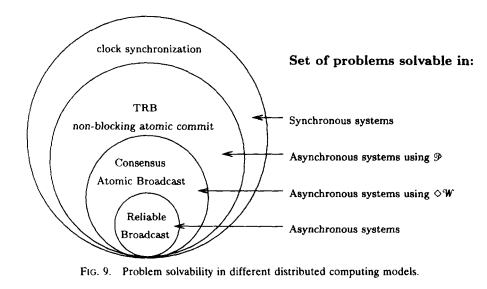

---
---
# Notes from Distributed Systems for Fun and Profit

When I started learning about distributed systems I have been taking notes mostly on my notebook, but it takes longer to reference it and go back. So I decided to keep my notes here when I decided to read this book.

## Chapter 1: Basics

Distributed systems is a way of doing a task with many computers instead of doing using one. To do this we have a constraint, that is to do using comodity hardware isntead of relying on most expensive hardware. This is because of a fundamental reason that as the nodes grow the performance difference between high-end hardware and comodity hardware decreases. So everything happens when scale grows, and the goal is to gain the scalability. Scalability can be defined as the ability to grow the system with the amount of work. This can be in terms of data size, computers to administrators ratio, decrease in latency with growing nodes etc.  

Scaleable systems have two properties: 1. Performance (latency) 2. Availability (fault-tolerance)

- Performance is achieving shorter response time OR high throughput OR low utilization of resources.   
In these three latency is interesting as it has little to do with financial limitations and more with physical limitations. Speed of light and hardware components at which they can work is a hard limit. E.g the time between the write initiated and confirmation response received.  
- Availability is proportion of the system functioning properly. If a user can not load the page the system is not available.  
Availability can be measured in terms in uptime, like a 90% availability means more than a month downtime per year. And 99.9% < 9 hours, 99.99% < less than an hour. Availability can be affected by many other factors than just the uptime of a service, like hard disks catching fire, a star falling from a sky or company going bankrupt. The best we can do is to design for fault tolerance. Fault tolerance = the ability to behave well when a fault occurs.

The hinderance between the above good things can be: increased number of nodes increases probability of failure of one node (fault-tolerance), increased number of nodes may result in more communcation (thus reduced performance, latency). Our system design options are beyond these physical constraints. Both performance and availability are defined by external guarantees such as SLAs. 

Making appropriate __abstractions__ for complex systems make them more manageable and understandable. In this regard __models__ can help concretely define what the properties of our system will be. Good abstractions remove the irrelevant details. Some models are: failure modes (crash/byzantine), system model (synchronous/asynchronous), consistency (weak/strong).
A system with weaker guarantees can be more performant/be available and also hard to reason about at the same time.  
Some failures types such as network latencies and network partitions means that a system has to make hard choices between whether its worth it to stay available and provide lose guarantees or reject the requests and play safe.

Design techniques: Partition and replicate  
1. Partition - means to divide data on multiple nodes and each partition is a subset of data. This help to improve performance by limiting the amount of data to work with in a partition. And increase availability by allowing partitions to fail independently.
2. Replication: Copying or reproducing something is something that we can use to fight latency. It improves performance by making the additional bandwidth and compute available. And it improves availability by increasing the copies of data by increasing the number of nodes which should fail before system become unavailable.  
Replicate to reduce the risk of single point of failure. Replicate data to a local cache to reduce latency or on multiple machines to increase throughput. Downsides of replication is that this data needs to be in sync, this means we need to make sure replication follow some consistency model.
Stronger consistency allows you to program the system as if the underlying system was not replicated. But other weaker consistency models expose some underlying details of the system and can offer lower latency and high availability.

## Chapter 2: Up and Down the Level of Abstraction

The fundamental tension is between how we want the system to behave, i.e as a single unit and how the system actually is, distributed. So we create abstractions, we assume that two nodes are equal even when they are not, this makes things easier and manageable. __Impossible results__ tell us that within our assumptions some things are impossible. In a distributed system, programs run concurrently on independent nodes, there is an unreliable network between them, and they have no shared memory or shared clock. This means that the knowledge in a particular node is local, any information about global state is normally out of date, clocks are not synchronized, nodes can fail and recover from a failure independently. A robust system would be that makes little or no assumtions. And we can also make a system with strong assumptions, e.g nodes do not fail a big assumption and system will not need to handle node failure, though this unrealistic assumption.  
- Nodes can fail by __crashing__ or in any arbitrary way other than crashing (__Byzantine fashion__). We only consider crash failure because we can't account infinite number of failures and then design our algorithm.  
- Communication links can be assumed to be __unreliable__ and subject to __message losts__/delays. A __network partition__ occurs when a network fails between nodes but nodes continue to be operational. These are enough assumptions without going into details of individual network links or counting distance between nodes (in a local network).  
- Timing assumptions are essential as the nodes have their own clocks and are at some distance from each other. Synchronous system where there exist __upper bound on message transmission delays__, and asynchronous where processes execute independently without any upper bound. Synchronous means that two processes have the same experience and messages sent will be received within a maximum delay, and processes execute in a lock step. Asynchronous assumes that we can't rely on timing, and assumtions about execution speeds, maximum message delays can help rule out failure scenarios as if they never happened. Real world systems can run occasionally processes within upper bounds but there are certainly times when there are delays and message loss.

### The consensus problem
Some computers are in consensus if they agree on some value. Stages of consensus 1. Agreement: every correct process must agree on a value 2. Integrity: every correct process decides on one value 3. Termination: all processes eventually reach a decision 4. Validity: if all processes reach on a certain value then they all decide that value. Consensus problem helps to solve more advanced problems such atomic commit and atomic broadcast.  
#### FLP Impossibility result
Assumes asynchronous model, it states that we can __not__ have a consensus in an asynchronous system where a process can fail by crashing, even if the messages are never lost. This means that there can not be a consensus if a process remain undecided for an arbitrary amount of time (by delaying message delivery).
#### The CAP theorem
Consistency in CAP means that all computers have the same copy of data or else the system refuses to answer. Availability means that system keeps giving answers even in the face of node failures. Partition tolerance means that system continues to operate even in the face of network division. Only two can be satisfied simultaneusly.
Picking CA: strict quorum protocols such as two phase commit. It can't tolerate any node failure. Strong conistency, it can't differentiate between network partition and node failure. common in traditional relational databases using two phase commit.
Picking CP: includes majority quorum protocols where minority partition is unavailable like Paxos. It can tolerate `n` node failures from `2n+1` nodes, means as long as `n+1` stay up. It makes the minority partition to __NOT__ accept writes and only majority partition can accept.
Picking AP: protocols that involves conflict resolution like DynamoDB
In the face of partition, CAP theorem reduces to __choose between Consistency and Availability__.
Four conclusions from CAP theorem:
- early system designs did not incorporate network partition in their design (mostly CA) but in today's times we can not ignore partitions as systems are spreaded in different geographic regions.
- there is a fundamental tension between strong consistency and high availability when network partition occur.
Strong consistency guarantee require us to give up availability during network partition. Because if we do not give up availability and two nodes can't communicate then we have a divergence. We can overcome this in two ways: 1. Not have partitions 2. weaken the guarantees
- there is a tension between strong consistency and performance in normal operation. Because all nodes must agree on the same result before moving on, this introduces latency. If we can __relax guarantees__ then we can have __less latency__ and __more availability__. If less nodes are involved in an operation we will have less time to wait for the result. Tradeoff here is that we allow to have some anomolies to occur, this means that you read some old data.
Consistency and availability are not binary choices, unless we fix ourselves to __strong consistency__. CAP consistency != ACID consistency.
Consistency is a broader term and strong consistency is just one form of it.
### Consistency models
Can be divided in two categories: 1. Strong consistency models 2. Weak consistency models
- Strong consistency models are: 1. _linearizable consistency_ is the one in which all operations appear to be executed atomically in the same order as the actual time ordering of operations, 2. _sequential consistency_ is same as linearizable except that operations may be executed in a different order than received.
- Weak consistency models are: 1. Client-centric models involve the notion of a client or session in some way. For example forwarding a client to the same replica after they update something so that they don't see older data themselves. 2. Eventual consistency, where all nodes will agree on the same value after an undefined amount of time. Eventually is very weak form of consistency. So lower bound on evntual should be defined. And also how long is eventual.

## Chapter 3: Time and Order
Other than distributed systems time is used by our personal computers as well, e.g to track how long a dns query is cacheable, or to track if a certificate is valid. Time helps in keeping track of the order of events in which they occured, and we care a lot about order since its easier to think about it by our brain, so time is an important property. 

There are two types of clocks: 1. *Physical clock*: to count the number of seconds elasped 2. *Logical clocks*: count events such as messages sent  

Physical clocks are made of Quartz crystal which vibrates at some frequency and we count the number of cycles and map it to seconds. The frequency at which it osccilates depends on temprature and though very precise but not perfect. Most quartz clocks deviate by 20 to 50ppm which is nearly 32 seconds per year. Atomic clocks are more accurate than quartz.

### Definition of time
How is time defined? Time is affected by how fast earth rotates. GMT(Greenwhich Mean Time, solar time) is literally defined by astronomical observation of the sun position as seen from Greenwich in South East London. Atomic clocks measure time by frequency at which Ceasium atom resonates. 1 day = 24*60*60*9,192,631,770 periods of cesium atom, cool. We want to use atomic time but also stay consistent with Earth's time. We do some corrections to atomic time to account for Earth's rotation and that gives us UTC time. All time zones are some offset to UTC time, e.g US east coast is UTC-5, Pakistan is UTC+5. So the time difference between Pak and US east coast is a10 hours. Unix time counts the number of seconds elasped since January 1st, 1970. Software simply ignores if leap second has to be incremented or decremented, so we don't care. But in distributed systems we can not ignore the shift of a second.  

_Total order_ and _partial order_ are mathematical relations, total order is the one where any two elements are comparable. A partial order requires some elements to be compareable in a set but not all. So every total order is a partial order but not vice versa. Time basically is a form of order, and timestamps really represent the state of a system at that timestamp. 

### Characteristics of time
We can simply attach timestamps to unordered events to make them _ordered_. Timestamps are comparebale values and can be _interpreted_ by humans to understand when something happened. Durations in time can be used by algorithms to make judgements about a system. For example, time spent in waiting can provide a clue if system is partitioned or is just experiencing high latency. Distributed systems do not behave in a particular order and imposing order is one way to reduce the possible executions.  

### Global vs Logical clocks
In the context of how we know time, its easier to picture total order instead of partial order. But its an assumption that things happened one after the other and making strong assumptions can lead us to a fragile system. The more temporal nondetermism we can tolerate the more we are closer the nature of distributed system. Does time progress at the same rate everywhere? This has 3 answers, for **Global clocks**: yes, for **Local clocks**: no but and for **No Clocks**: No!. 
Total order Clocks are important to assign the order to operations. A synchronous system has a global clock and in an asynchronous system there is no clock. A global clock is a source of total order, but its limited by the latency of a clock synchronisation protocol like NTP among other things. In this regard Facebook's Cassandra is an example which uses timestamps to resolve conflicts between writes. The writes with newest timestamps wins. Means if clock drifts then new writes might be overwritten by old ones.  
No-Clock assumption: here we have a notion of logical time using **counters** as timestamps. _We can order events between different machines using counters and find out if something happened before or after or at the same time of another._ In a partial order not every pair of elements is comparable. For example if event x happens on machine A and event y happens on machine B and there was no communication between them then we can't say that A happened before B (A->B) or B happened before A (B->A). All of this in the absense of a global clock. So what Lamport clocks guarantee is this: if A -> B then counter(A) < counter(B) but not the other way around. This is partial order.

Time can define order across systems without communication and sometimes correctness depends on correct event ordering (such as in serializing in distributed database). Only global clock can help order the events across two machines. Without global clock we need to communicate with other machines. Time can also be used to define boundary conditions for algorithms using timeouts, such as to define the difference high latency and a server is down. The algorithms that do this are called failure detectors.  

### Vector clocks
How can we order events without synchronizing the clocks, enters Lamport Clocks. Lamport clocks and vector clocks use **counters** and communication to define order and are replacements of physical clocks. This counter is compareable across machines.

This is how Lamport clock works:
- If a process does work, increment the counter
- If process sends a message, include the counter
- When a message is received, set the counter to `max(local_counter, received_counter)+1`

So Lamport clock allows counters to be compared across systems with one caution: it says if counter(A)< counter(B) then either A happened before B or A is incomparable with B. Remember comparing Lamport timestamps across systems that never communicate with each other may lead us to assuming some event happened before another when in reality they happened concurrently. So you can't say anything meaningful about events on two independent systems that are not causaly related.

A **Vector Clock** maintains an array of N logical clocks, one for each node. Each node increments its own counter instead of incrementing a common counter. Rules are
- Whenever a process does work, increment the logical clock value of the node in the vector
- Whenever process sends message, include the full vector of logical clocks
- When a message is received:  
_Update each element in the vector to be max(local, received)_ AND _Increment the logical clock value representing the current node in vector_

The problem with vector clocks is that they require one entry per node and thus can become very large for big systems. This problem can be countered by techniques such as periodic garbage collection or by reducing accuracy by limiting the size.

### Failure detectors
The amount of time spent waiting can provide clues about whether a system is partitioned or merely experiencing high latency. Here we don't need a global clock with perfect accuracy, instead it is simply enough that there is a reliable-enough local clock. In the absense of a response from a remote machine we can assume that a node has failed after some reasonable amount of time. What should be _reasonable time_? Instead of specifying specific values, its better to abstract away the exact timing assumptions. 

Here comes the **failure detectors**. They are based on **heartbeat messages** and **timers**. Failure detector based on timeout has a risk of being too aggressive(too quick to declare failure) or too conservative (taking too long to detect a failure).
Failure detectors are characterized by two properties: _completeness and accuracy_.
- Strong completeness: every crashed process is eventually suspected by every correct process
- Weak completeness: every crashed process is eventually suspected by some correct process
- Strong accuracy: No correct process is suspected ever
- Weak accuracy: Some correct process is never suspected
Completeness is easier to achieve than accuracy. In fact weak completeness can be transformed to strong completeness by broadcasting the information about suspected process. But avoiding incorrectly suspecting a non-faulty process is hard unless you have a hard limit on message delay. This is only possible in synchronous system model. Therefore in systems where **hard bounds are not set** on message delays, failure detectors can **only be eventually accurate**.

The image below is taken from Chandra et al. (1996) paper.

This diagram shows that some problems can not be solved without strong assumptions about time bounds (failure detectors), it is not possible to tell whether a remote
node has crashed, or is simply experiencing high latency. 

### Implementing a failure detector
Conceptually, there isn't much to a simple failure detector, which simply detects failure when a timeout expires. The most **interesting part relates to how the judgments are made about whether a remote node has failed**. Ideally we would want a failure detector to adjust based on network conditions and avoid hard coding timeout values. For example Cassandra uses an accrual failure detector, which is a failure detector that outputs a suspicion level (a value between 0 and 1) rather than a binary "up" or "down" judgment. So there has to be a tradeoff between accurate detection and early detection of failure which left to the application.

When is order/synchronicity really needed? It depends on a system in consideration. In many cases we want the responses from a database to represent all of the available
information with no inconsistency. In other cases, it is acceptable to give an answer that only represents the best known estimate that is based on only a subset of the total information. In particular during a network partition, one may want to answer queries with only part of the system accessible. For example, is the Twitter follower count for some user X, or X+1? Or are movies A, B and C the absolutely best answers for some query? Doing a cheaper, mostly correct "best effort" can be acceptable.